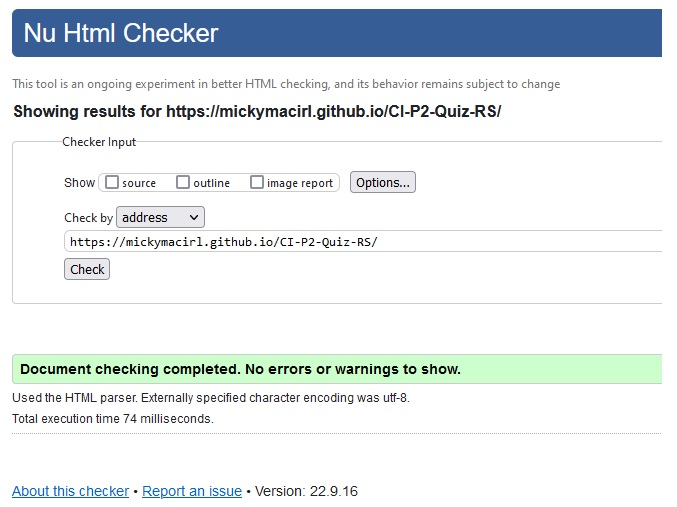

# CISM Certification Quiz Game

ISACA's Certified Information Security Manager (CISM) certification is for those who want to advance from team player to manager and have technical expertise and experience in IS/IT security and control.

The quiz consists of ten questions designed to assess an individual's knowledge of the CISM certification.

View the live site: *[here](https://mickymacirl.github.io/CI-P2-Quiz-RS/)*

## Features of Website

### Header

- The header of the website is responsive on all devices, which remains at the top of the page consistantly.

### NavBar

- The navbar of the website is responsive on all devices, which changes positon based on the width of the browser on a device.

### Footer

- The footer of the website is responsive on all devices, which changes postion based on the width of the browser on a device.

### Index Page

- The index page displays the quiz's landing page and has a text field to accept a username and a submit button.

### Question Page

- The Game Page contains the main game board, header, and footer and the about section.

### Features to be Added

- In this game it would be useful to have a high scores and to remember username when visiting site.

- This game could have additional questions from the CISM or other ISACA certifications.

- Expand the test and have the answers in a seprate json file.

## Design Choices

### Colors

- The colors used are used from the CISM logo, being green and seagreen.

### Fonts

### Logo

- Logo is a modifed logo from CISM webpage.

### Wireframes

## User Goals

- Visually attractive website.
- It is easy to navigate the website.

## User Stories

## Site Owner Goals

## Technology

### HTML

- The structure of this website uses *[HTML](https://en.wikipedia.org/wiki/HTML)*.

### CSS

- The website was styled by connecting a custom *[CSS](https://en.wikipedia.org/wiki/CSS)* to an external file.

### JavaScript

- This quiz's questions uses *[JavaScript](https://en.wikipedia.org/wiki/JavaScript)* to an external file.

### Visual Studio Code

- The website was developed using *[Visual Studio](https://visualstudio.microsoft.com/)* Code IDE.

### GitHub

- Source code is hosted on *[GitHub](https://github.com/)* and deployed using *[GitPages](https://pages.github.com/)*.

### Adobe Photoshop

- Used *[Adobe Photoshop](https://www.adobe.com/products/photoshop.html)* for overall design and logo images.

### Adobe Dreamweaver

- The website was tested and designed using *[Adobe Dreamweaver](https://www.adobe.com/products/dreamweaver.html)*.

### Google Fonts

- This website uses *[Google Fonts](https://fonts.google.com/)*.

### balsamiq

- Created wireframes for this website using *[balsamiq](https://balsamiq.com/wireframes/desktop/#/)*.

## Testing

### Validator Testing

- Used *[W3C CSS Validator](https://jigsaw.w3.org/css-validator)* to validate the CSS on this stie, no errors are found.

 Used *[W3C HTML Validator](https://jigsaw.w3.org/css-validator)* to validate the HTML on this stie, no errors are found.

 Used *[Javascript Validator](https://jshint.com/)* to validate the Javascript on this stie, with one error saying that checkAnswer is unused. checkAnswer is used in the quiz.html file to check the quiz players answer so is not used within the javascript file.

### Wave Testing

- Used Wave to test the pages. The index page is showing an unlabeled sumbit button error, was not able to fix this due to lack of time.

## Deployment

### Template

- A repository called 'CI-P2-Quiz-RS' was created using the *[Code Institute GitPod Full Template](https://github.com/Code-Institute-Org/gitpod-full-template)*.

### Version Control

Both *[Visual Studio](https://visualstudio.microsoft.com/)* code editor and *[GitPod](https://gitpod.io/workspaces)* were used to create this site and then pushed to the GitHub remote repository named ‘*[CI-P2-Quiz-RS](https://github.com/mickymacirl/CI-P2-Quiz-RS)*’.

The following commands were used to push code to the remote repository:

1. *git add .* was used to stage all files for commit changes.

2. *git commit -m “commit message”* was used to add the changes to the local repository for upload during a push.

3. *git push* was used to push all local changes to the remote repository on GitHub.

### Deployment to GitHub Pages

The site was deployed to GitHub Pages.

Below are the steps required:

1. In **GitHub**, navigate to your username.github.io repository and click Settings.
2. Within Settings, navigate to the Source section within the **GitHub Pages** section. From the dropdown menu, select the master branch and then click Save.

### Deploying New Changes

Once **GitHub Pages** is set up, normal **GithHub** flow updates the live page.

View the live site: *[here](https://mickymacirl.github.io/CI-P2-Quiz-RS/)*

### Forking the Repository

Forking creates a copy of the repository to view and/or make changes without affecting the original.

Below are the steps required:

1. In **GitHub**, access the specific **GitHub** Repository - *[Quiz Game](https://github.com/mickymacirl/CI-P2-Quiz-RS)*
2. You will find and click the **"Fork"** button on the top right of the repository page underneath the user icon.
3. You will have successfully created a copy of the original repository within the logged-in **GitHub** account.

### Clone the 'CI-P2 Quiz-RS' GitHub Code Repository locally

1. Go to the page of the repository that you want to clone, the **CI-P2-Quiz-RS GitHub** site: *[here](https://github.com/mickymacirl/CI-P2-Quiz-RS)*
2. Click on the **“Code”** menu and copy the URL.
3. Use the git clone command along with the copied URL.
4. git clone <https://github.com/USERNAME/REPOSITORY>

## Credits

### Mentor Support

- Mentor support from *[Daisy McGirr](https://github.com/Daisy-McG)*.

### Markdown Language

- Used syntax from *[Markdown Guide](https://www.markdownguide.org/basic-syntax/)* for reference.

### Markdown TOC Generator

- Used Ecotrust Canada's *[Markdown TOC Generator](https://ecotrust-canada.github.io/markdown-toc/)* to build Readme TOC.

### Meta Tags

- Used SEO Timers *[Meta Tag Generator](https://www.seoptimer.com/meta-tag-generator)* to generate HTML meta-tags.

### CISM Questions

- Used CISM Questions from *[Certification-Questions.com](https://www.certification-questions.com/pdf-download/isaca/cism-pdf.pdf)* to build the 10 questions.

### Localstorage Username

- Used Stackoverflow for *[Stackoverflow Username](https://stackoverflow.com/questions/58750774/ask-user-enter-name-with-javascript-and-html)* username capture reference.

### Quiz Outline

- Used Stackoverflow for *[Stackoverflow Quiz Game](https://stackoverflow.com/questions/58894468/i-am-making-quiz-web-application-using-javascript-for-all-functions-posting-my-q)* javascript reference.

### JavaScript Basics

- JavaScript Basics from *[JsChallenger.com](https://www.jschallenger.com/javascript-fundamentals/javascript-basics)*.

### Favicon Generator

- Used *[Favicon & App Icon Generator](https://www.favicon-generator.org/)* to generate the favicon and *[W3 Schools HTML Favicon](https://www.w3schools.com/html/html_favicon.asp)* for the HTML.

### Mozilla.org Reference

- Reference from *[Mozilla.org](https://developer.mozilla.org/en-US/docs/Web/JavaScript/Reference)*.

### Unicorn Revealer

- Used *[Unicorn Revealer](https://chrome.google.com/webstore/detail/unicorn-revealer/lmlkphhdlngaicolpmaakfmhplagoaln?hl=en-GB)* to troubleshoot layout and responsiveness.

### Chrome Dev Tools

- Used *[Chrome Dev tools](https://developers.google.com/web/tools)* to debug code and troubleshoot layout and responsiveness.

### W3School Responsive

- Used *[W3School Responsive](https://www.w3schools.com/html/html_responsive.asp)* for layout and responsiveness.

### Media Genius

- Used *[Media Genius](<https://responsivedesignchecker.com/>)* responsiveness website to troubleshoot layout and responsiveness.

### markdownlint

- Used *[MarkdownLint](https://open-vsx.org/extension/DavidAnson/vscode-markdownlint)* extension in Visual Studio to troubleshoot markdown errors in readme's.

### Color Picker

- Used *[Color Picker](https://imagecolorpicker.com/en)* to pick colors from CISM Logo.

### GitLens 12

- Used *[GitLens 12](https://open-vsx.org/extension/eamodio/gitlens)* extension in Visual Studio to help overall Git management.

### Grammarly Office Plugin

- Used *[Grammarly Office Plugin](https://www.grammarly.com/office-addin)* on spelling, grammar, punctuation, clarity, and writing style in the ReadMe's.

### Git and GitHub

- Used *[W3C Git Tutorial](https://www.w3schools.com/git/default.asp?remote=github)* for reference.

- Used *[GitHub Git-Guides](https://github.com/git-guides)* for reference.

### GitPod

- Used *[GitPod Help Page](https://www.gitpod.io/support)* for reference.

### Multi-Device Website Mockup Generator

- Used *[Multi Device Website Mockup Generator](https://techsini.com/multi-mockup/index.php)* to create multi-device mockup.

### Version Control Reference

- Used Our Coding Club *[GitHub.io](https://ourcodingclub.github.io/tutorials/git/)* How To's for reference.

## Content

- Logo from *[ISACA.org](https://www.isaca.org/credentialing/cism)* website and resized using *[Adobe Photoshop](https://www.adobe.com/products/photoshop.html)*.

- Icons from *[macovector_official on Freepik](https://www.freepik.com/free-vector/hacker-icons-flat-set_4376519.htm#query=cyber%20security%20icon&position=25&from_view=keyword")* on Freepik website.
